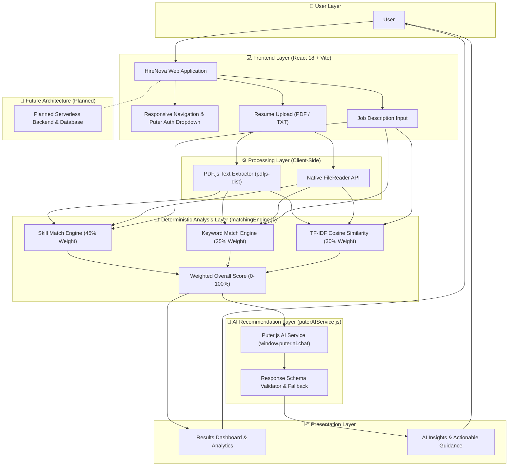

# HireNova
### Resume & Job Description Matching Tool

> «An AI-powered platform for intelligent resume-job matching, skill-gap identification, and career insights.»

---

## Table of Contents

- [Project Overview](#project-overview)
- [Problem Statement](#problem-statement)
- [Proposed Solution](#proposed-solution)
- [Key Features](#key-features)
- [System Architecture](#system-architecture)
- [Application Workflow](#application-workflow)
- [Technology Stack](#technology-stack)
- [Project Structure](#project-structure)
- [Installation and Setup](#installation-and-setup)
- [Usage](#usage)
- [Current Development Status](#current-development-status)
- [Future Enhancements](#future-enhancements)
- [Team Members](#team-members)
- [Project Goals](#project-goals)
- [Conclusion](#conclusion)
- [License](#license)

---

## Project Overview

**HireNova** is an AI-powered web application built to help students, fresh graduates, and job seekers evaluate how well their resumes align with specific job descriptions before applying for internships and employment opportunities.

In the modern job market, candidates often face the challenge of manually analyzing complex job postings:

$$\text{Resume} \longrightarrow \text{Job Description} \longrightarrow \text{Required Skills} \longrightarrow \text{Keywords} \longrightarrow \text{Qualifications}$$

Manually comparing these elements across multiple applications is tedious, inefficient, and prone to oversight. Candidates frequently miss critical technical keywords or fail to recognize major skill gaps before submitting their resumes.

**HireNova** automates this comparison by combining a **deterministic matching engine** (TF-IDF Cosine Similarity, Skill Coverage, and Keyword Coverage) with a **Puter AI intelligence layer**.

### Major Application Outputs
- **Matching Skills**: Technical and professional skills present in both the resume and job description.
- **Relevant Keywords**: Important recurring domain-specific terms detected in the job posting.
- **Missing Skills**: Critical skill gaps categorized into *Required* vs *Preferred* requirements.
- **Resume–Job Match Score**: An algorithmic weighted alignment score (45% Skill Match + 25% Keyword Match + 30% Cosine Similarity).
- **AI Recommendations**: Actionable resume improvement guidance generated via Puter AI.
- **Job Relevance Insights**: Application readiness status and role requirement snapshot.

---

## Problem Statement

Students and job seekers frequently submit job applications without knowing whether their resumes sufficiently match the requirements of the target role. Job postings contain numerous technical requirements, software tools, qualifications, and industry keywords. Manually comparing these items against a resume is time-consuming and often causes candidates to overlook critical requirements.

Candidates frequently lack clarity regarding:
- Which required skills they already possess on their resume.
- Which critical skills are missing from their application.
- Which specific keywords are most important for the role.
- How relevant their overall experience is to the job description.
- What specific, genuine improvements they should make before submitting their application.

> **Problem Statement:**
> «How can candidates quickly understand the alignment between their resume and a specific job description and identify the areas they need to improve?»

---

## Proposed Solution

**HireNova** delivers an automated, intelligent analysis pipeline that converts unstructured resume files and job postings into structured, actionable career intelligence:

$$\text{Resume (PDF/TXT)} + \text{Job Description} \longrightarrow \text{Deterministic Matching Engine} \longrightarrow \text{Match Score} \longrightarrow \text{Puter AI Layer} \longrightarrow \text{Results Dashboard}$$

Instead of manually reviewing job postings line-by-line, candidates receive instant analytical feedback alongside prioritized, AI-generated guidance that empowers them to optimize their resumes authentically.

---

## Key Features

| Feature | Description | Status |
| :--- | :--- | :--- |
| **Puter.js Authentication** | Secure user authentication and session management via official Puter.js SDK (`puter.auth`) | **Implemented** |
| **Protected Dashboard** | Protected route system (`ProtectedRoute.jsx`) guarding `/dashboard` and `/job-matcher` | **Implemented** |
| **Resume Text Extraction** | Real client-side text parsing for `.pdf` (via `pdfjs-dist`) and `.txt` files without server upload | **Implemented** |
| **Job Description Analysis** | Multiline input processing with live character counting and status indicators | **Implemented** |
| **Skill Matching** | Identifies matching technical skills against a comprehensive career skill database | **Implemented** |
| **Keyword Matching** | Extracts recurring n-grams and checks presence in the candidate resume | **Implemented** |
| **Missing Skill Detection** | Categorizes missing skills into *Required Skill Gaps* vs *Preferred Skill Gaps* | **Implemented** |
| **Resume–Job Match Score** | Weighted formula: 45% Skill Match + 25% Keyword Match + 30% TF-IDF Cosine Similarity | **Implemented** |
| **AI Match Explanation** | Explains positive alignment contributors and score reduction factors using Puter AI | **Implemented** |
| **Priority Skill Gaps** | Categorizes missing skills into High, Medium, and Low priority with suggested actions | **Implemented** |
| **Keyword Improvement** | Recommends keyword enhancements with genuine experience caveats | **Implemented** |
| **Actionable Guidance** | Generates up to 5 prioritized, actionable recommendations to improve the resume | **Implemented** |
| **Role Requirement Snapshot** | Summarizes job postings into Core Skills, Supporting Skills, Tools, and Responsibilities | **Implemented** |
| **Application Readiness** | Evaluates overall alignment (Strongly Aligned, Mostly Aligned, Needs Improvement) | **Implemented** |
| **AI Fallback System** | Ensures score and match calculations remain fully functional if AI service is offline | **Implemented** |
| **Glassmorphism SaaS UI** | Premium light lavender/blue theme, frosted glass cards, backdrop blur, and responsive design | **Implemented** |
| **ATS Resume Builder** | Tool for creating ATS-optimized resume formatting | *Integration Stage* |
| **AI Mock Interview** | Interactive role-specific interview practice room | *Integration Stage* |
| **Resume Version Control** | Tracking resume iterations and match score improvements over time | *Integration Stage* |

---

## System Architecture



---

## Application Workflow

- **Step 1: Application Access (`Implemented`)**  
  The user opens HireNova and authenticates securely via Puter.js (`puter.auth.signIn()`). Unauthenticated users attempting to access `/dashboard` or `/job-matcher` are automatically redirected to `/login`.

- **Step 2: Resume Input & Extraction (`Implemented`)**  
  The user uploads a `.pdf` or `.txt` resume via file picker or drag-and-drop. Text is extracted client-side using `pdfjs-dist` or `FileReader` without requiring manual retyping.

- **Step 3: Job Description Input (`Implemented`)**  
  The user pastes the target job description into the multiline input card. Live character counts and validation indicators confirm input readiness.

- **Step 4: Deterministic Match Execution (`Implemented`)**  
  The user clicks **"Analyze Match →"**. The matching engine ([`matchingEngine.js`](file:///c:/Users/HP/Desktop/Hirenova/src/services/matchingEngine.js)) instantly processes both texts using TF-IDF vectorization, Cosine Similarity, Skill Coverage, and Keyword Coverage.

- **Step 5: Analytical Results Display (`Implemented`)**  
  The dashboard renders the official weighted match score, score label, score breakdown gauge, matched skills, missing skills (Required vs Preferred), matched keywords, and missing keywords.

- **Step 6: AI Insights Generation (`Implemented`)**  
  The user clicks **"Generate AI Insights"**. The Puter AI service ([`puterAIService.js`](file:///c:/Users/HP/Desktop/Hirenova/src/services/puterAIService.js)) sends the deterministic match data to `window.puter.ai.chat()`.

- **Step 7: AI Response Validation & Fallback (`Implemented`)**  
  The response is validated by [`aiResponseValidator.js`](file:///c:/Users/HP/Desktop/Hirenova/src/utils/aiResponseValidator.js). If Puter AI is offline or returns malformed data, a graceful fallback banner appears while analytical results remain fully functional.

- **Step 8: Actionable Guidance Display (`Implemented`)**  
  The dashboard renders AI Score Explanation, Priority Skill Gaps (High/Medium/Low), Keyword Suggestions, Top 5 Resume Improvements, Role Snapshot, and Application Readiness.

- **Step 9: ATS Resume Export (`Integration Stage`)**  
  Option to generate an ATS-formatted resume version based on matched skills.

- **Step 10: AI Mock Interview Practice (`Integration Stage`)**  
  Practicing role-specific interview questions generated from the missing skills list.

---

## Technology Stack

### Frontend
- **Framework**: React 18 (`react`, `react-dom`)
- **Build Tool**: Vite 5 (`vite`, `@vitejs/plugin-react`)
- **Routing**: React Router DOM v6 (`react-router-dom`)
- **Icons**: Lucide React (`lucide-react`)
- **Styling**: Vanilla CSS Design System with Glassmorphism variables, backdrop blur, ambient glows, and responsive layout utilities.
- **Document Parsing**: PDF.js (`pdfjs-dist` v3.11.174) with bundled local Vite worker and raw stream fallback decoder.

### AI / Application Platform
- **Authentication**: Puter.js SDK (`puter.auth.signIn`, `puter.auth.isSignedIn`, `puter.auth.getUser`, `puter.auth.signOut`)
- **AI Service**: Puter.js AI Chat (`window.puter.ai.chat`)
- **Matching Engine**: Custom client-side TF-IDF Vectorizer and Cosine Similarity Calculator.

### Backend
> *Backend server and database integration are currently planned for a future development phase. The application currently operates serverless using client-side execution and the Puter.js platform.*

### Development & Version Control Tools
- **IDE**: Visual Studio Code
- **Package Manager**: `npm`
- **Version Control**: Git & GitHub

---

## Project Structure

```
HireNova/
├── public/
│   └── favicon.svg
├── src/
│   ├── components/
│   │   ├── AiInsightsSection.css
│   │   ├── AiInsightsSection.jsx
│   │   ├── DashboardCard.css
│   │   ├── DashboardCard.jsx
│   │   ├── FeatureCard.css
│   │   ├── FeatureCard.jsx
│   │   ├── Footer.css
│   │   ├── Footer.jsx
│   │   ├── Hero.css
│   │   ├── Hero.jsx
│   │   ├── MobileMenu.css
│   │   ├── MobileMenu.jsx
│   │   ├── Navbar.css
│   │   ├── Navbar.jsx
│   │   ├── PageHeader.css
│   │   ├── PageHeader.jsx
│   │   ├── PlaceholderState.css
│   │   ├── PlaceholderState.jsx
│   │   ├── ProtectedRoute.css
│   │   ├── ProtectedRoute.jsx
│   │   ├── ReadinessCard.css
│   │   ├── ReadinessCard.jsx
│   │   ├── ScoreBreakdownCard.css
│   │   ├── ScoreBreakdownCard.jsx
│   │   ├── SkillsKeywordsResults.css
│   │   ├── SkillsKeywordsResults.jsx
│   │   ├── StepIndicator.css
│   │   ├── StepIndicator.jsx
│   │   ├── TextPreviewModal.css
│   │   ├── TextPreviewModal.jsx
│   │   ├── UserDropdown.css
│   │   └── UserDropdown.jsx
│   ├── context/
│   │   └── AuthContext.jsx
│   ├── pages/
│   │   ├── AiMockInterviewPage.jsx
│   │   ├── BuildAtsResumePage.jsx
│   │   ├── CompareResumesPage.jsx
│   │   ├── DashboardPage.css
│   │   ├── DashboardPage.jsx
│   │   ├── JobMatcherPage.css
│   │   ├── JobMatcherPage.jsx
│   │   ├── LandingPage.css
│   │   ├── LandingPage.jsx
│   │   ├── LoginPage.css
│   │   ├── LoginPage.jsx
│   │   ├── ProfilePage.css
│   │   └── ProfilePage.jsx
│   ├── services/
│   │   ├── matchingEngine.js
│   │   └── puterAIService.js
│   ├── utils/
│   │   ├── aiResponseValidator.js
│   │   └── pdfExtractor.js
│   ├── App.jsx
│   ├── index.css
│   └── main.jsx
├── index.html
├── package.json
├── vite.config.js
└── README.md
```

### Component & Folder Directory Overview
- **`src/services/`**: Core intelligence engines ([`matchingEngine.js`](file:///c:/Users/HP/Desktop/Hirenova/src/services/matchingEngine.js) for deterministic TF-IDF/skill math and [`puterAIService.js`](file:///c:/Users/HP/Desktop/Hirenova/src/services/puterAIService.js) for Puter AI calls).
- **`src/utils/`**: Helper utilities ([`pdfExtractor.js`](file:///c:/Users/HP/Desktop/Hirenova/src/utils/pdfExtractor.js) for client-side PDF/TXT text parsing and [`aiResponseValidator.js`](file:///c:/Users/HP/Desktop/Hirenova/src/utils/aiResponseValidator.js) for JSON validation and fallback handling).
- **`src/context/`**: React authentication provider ([`AuthContext.jsx`](file:///c:/Users/HP/Desktop/Hirenova/src/context/AuthContext.jsx)) interfacing with Puter.js auth API.
- **`src/components/`**: Reusable UI components including score breakdown gauges, skills/keywords pills, preview modals, step indicators, and AI insight blocks.
- **`src/pages/`**: Primary application views ([`LandingPage.jsx`](file:///c:/Users/HP/Desktop/Hirenova/src/pages/LandingPage.jsx), [`LoginPage.jsx`](file:///c:/Users/HP/Desktop/Hirenova/src/pages/LoginPage.jsx), [`DashboardPage.jsx`](file:///c:/Users/HP/Desktop/Hirenova/src/pages/DashboardPage.jsx), and [`JobMatcherPage.jsx`](file:///c:/Users/HP/Desktop/Hirenova/src/pages/JobMatcherPage.jsx)).

---

## Installation and Setup

### Prerequisites
- Node.js (v18.0.0 or higher recommended)
- `npm` (v9.0.0 or higher)

### 1. Clone Repository
```bash
git clone https://github.com/hanisha-senthilkumar/hirenova-ai-resume.git
cd hirenova-ai-resume
```

### 2. Install Dependencies
```bash
npm install
```

### 3. Start Local Development Server
```bash
npm run dev
```

The application will be accessible locally at:
`http://localhost:3000`

### 4. Build for Production
```bash
npm run build
```

---

## Usage

1. **Sign In**: Access HireNova and click **"Continue with Puter"** to authenticate via the Puter.js popup.
2. **Navigate to Job Matcher**: Open the Job Matcher view from the Navbar or Dashboard CTA.
3. **Upload Resume**: Drag and drop a `.pdf` or `.txt` resume file, or click **Browse File**.
4. **Preview Extracted Text**: Click **Preview Text** to verify the extracted text content.
5. **Paste Job Description**: Paste the target job description into the multiline input field.
6. **Calculate Match Score**: Click **"Analyze Match →"** to execute the deterministic matching engine and view instant score breakdown, matched skills, and missing keywords.
7. **Generate AI Insights**: Click **"Generate AI Insights"** to receive Puter AI score explanations, prioritized skill gap analysis, keyword recommendations, and actionable resume guidance.
8. **Refine Resume**: Review the top 5 actionable suggestions to update your resume before submitting your job application.

---

## Current Development Status

### Phase 1 — Frontend & Authentication (`Implemented`)
- [x] Responsive glassmorphism SaaS interface
- [x] Puter.js authentication integration (`puter.auth.signIn`, `signOut`)
- [x] Protected routes system (`ProtectedRoute.jsx`)
- [x] Mobile drawer navigation and user profile dropdown

### Phase 2 — File Parsing & Input Pipeline (`Implemented`)
- [x] Client-side PDF text extraction (`pdfjs-dist`) with local worker configuration
- [x] Native `.txt` text file reading
- [x] File validation (format, corruption, 10MB size limit)
- [x] Drag-and-drop file upload zone
- [x] Extracted text preview modal with clipboard copy
- [x] Multiline Job Description input with character counter

### Phase 3 — Deterministic Matching Engine (`Implemented`)
- [x] TF-IDF Term Frequency-Inverse Document Frequency vectorizer
- [x] Cosine Similarity vector comparison (0–100%)
- [x] Comprehensive technical skill extraction dictionary
- [x] Required vs Preferred skill gap categorization
- [x] Matched vs Missing keywords detection
- [x] Weighted match score calculation (45% Skill + 25% Keyword + 30% Cosine)

### Phase 4 — Puter AI Intelligence Layer (`Implemented`)
- [x] Puter AI Integration (`window.puter.ai.chat`)
- [x] AI Match Explanation & alignment summary
- [x] Priority Skill Gaps categorization (High / Medium / Low)
- [x] Keyword Improvement Suggestions with genuine experience caveats
- [x] Top 5 Actionable Resume Improvement Steps
- [x] Role Requirement Snapshot & Application Readiness
- [x] Safe JSON Response Validator & Fallback System

---

## Future Enhancements

- **AI ATS Resume Export**: Exporting tailored, ATS-compliant PDF resumes directly from match analysis.
- **Personalized Skill Roadmaps**: Automatically linking missing skill gaps to curated learning courses.
- **Multi-Job Description Comparison Matrix**: Comparing one resume against multiple job descriptions simultaneously.
- **AI Mock Interview Simulator**: Generating voice/text practice interview questions based on identified missing skills.
- **Application Tracking System (ATS) Pipeline**: Tracking application submission statuses and match scores over time.
- **Serverless Database History**: Storing past match analyses securely in Puter cloud storage.

---

## Team Members

### Team Name: MetaMinds

| Role | Team Member |
| :--- | :--- |
| **Team Lead** | Harsithaa Prakash |
| **Team Member** | Hanisha Senthilkumar |
| **Team Member** | Kanish Kumar |

---

## Project Goals

- **Accelerate Resume Evaluation**: Reduce the time needed to evaluate resume-job alignment from hours to seconds.
- **Eliminate Blind Applications**: Provide job seekers with data-driven insights into their application strength before applying.
- **Identify Genuine Skill Gaps**: Clearly highlight missing required skills so candidates can focus learning efforts effectively.
- **Empower Authentic Resume Optimization**: Provide actionable guidance that encourages candidates to highlight genuine experience without resorting to resume fraud.
- **Provide Accessible Career Tools**: Offer a free, serverless, web-accessible tool for students and job seekers.

---

## Conclusion

**HireNova** bridges the gap between candidate resumes and employer job requirements by combining client-side deterministic algorithms with AI intelligence. By delivering instant score breakdowns, clear skill gap identification, and prioritized improvement guidance, HireNova empowers job seekers to make smarter, data-driven decisions and optimize their career applications.

---

## License

No license has been specified for this project yet.